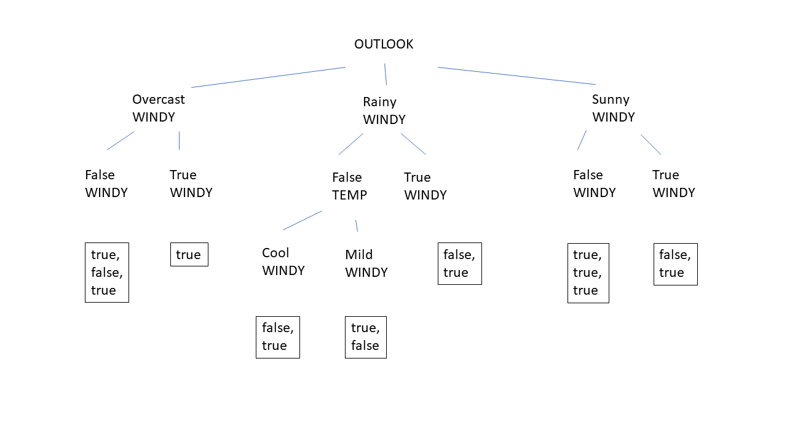

# decision-tree-homework
homework for a decision tree



```
OUTLOOK with Map(
    overcast -> List(
        WeatherData(overcast,mild,high,false,true), 
        WeatherData(overcast,mild,high,false,false), 
        WeatherData(overcast,hot,normal,false,true), 
        WeatherData(overcast,mild,high,true,true)), 
    rainy -> List(
        WeatherData(rainy,cool,normal,false,true), 
        WeatherData(rainy,cool,normal,true,false), 
        WeatherData(rainy,cool,normal,true,true), 
        WeatherData(rainy,mild,normal,true,true), 
        WeatherData(rainy,mild,high,true,false)), 
    sunny -> List(
        WeatherData(sunny,hot,high,true,false), 
        WeatherData(sunny,hot,high,false,true), 
        WeatherData(sunny,cool,normal,false,true), 
        WeatherData(sunny,mild,normal,false,true), 
        WeatherData(sunny,mild,high,true,true)))
=================================
WINDY with Map
    false -> List(
        WeatherData(overcast,mild,high,false,true), 
        WeatherData(overcast,mild,high,false,false), 
        WeatherData(overcast,hot,normal,false,true)), 
    true -> List(
        WeatherData(overcast,mild,high,true,true)))
WINDY with Map(
    false -> List(
        WeatherData(overcast,mild,high,false,true), 
        WeatherData(overcast,mild,high,false,false), 
        WeatherData(overcast,hot,normal,false,true)))
WINDY with Map(
    true -> List(
        WeatherData(overcast,mild,high,true,true)))
=================================
WINDY with Map(
    false -> List(
        WeatherData(rainy,cool,normal,false,true)), 
    true -> List(
        WeatherData(rainy,cool,normal,true,false), 
        WeatherData(rainy,cool,normal,true,true), 
        WeatherData(rainy,mild,normal,true,true), 
        WeatherData(rainy,mild,high,true,false)))
WINDY with Map(
    false -> List(
        WeatherData(rainy,cool,normal,false,true)))
TEMP with Map(
    cool -> List(
        WeatherData(rainy,cool,normal,true,false), 
        WeatherData(rainy,cool,normal,true,true)), 
    mild -> List(
        WeatherData(rainy,mild,normal,true,true), 
        WeatherData(rainy,mild,high,true,false)))
WINDY with Map(
    true -> List(
        WeatherData(rainy,cool,normal,true,false), 
        WeatherData(rainy,cool,normal,true,true)))
WINDY with Map(
    true -> List(
        WeatherData(rainy,mild,normal,true,true), 
        WeatherData(rainy,mild,high,true,false)))
=================================
WINDY with Map(
    false -> List(
        WeatherData(sunny,hot,high,false,true), 
        WeatherData(sunny,cool,normal,false,true), 
        WeatherData(sunny,mild,normal,false,true)), 
    true -> List(
        WeatherData(sunny,hot,high,true,false), 
        WeatherData(sunny,mild,high,true,true)))
WINDY with Map(
    false -> List(
        WeatherData(sunny,hot,high,false,true), 
        WeatherData(sunny,cool,normal,false,true), 
        WeatherData(sunny,mild,normal,false,true)))
WINDY with Map(
    true -> List(
        WeatherData(sunny,hot,high,true,false), 
        WeatherData(sunny,mild,high,true,true)))
```
